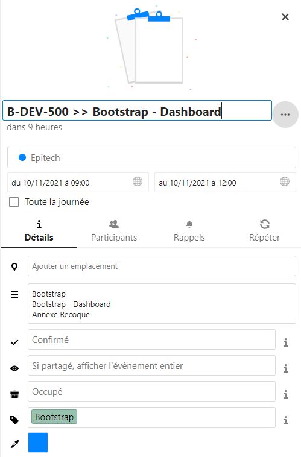
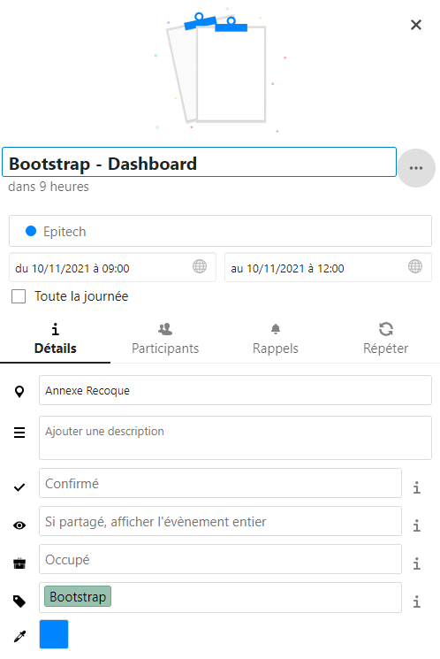

# Caldav Epitech Intranet Intration

Import the intranet calendar to any Nextcloud Calendar (or any other Caldav Client)

## What is the purpose of this repository?

I done this small integration based on the nice work of @stefan-muc [caldav-calendar-import](https://github.com/stefan-muc/caldav-calendar-import) because the subscription link available for our calendar in the Epitech intranet is malformated and inconsistent, with redundant data and some misplaced data fields.

I dockerized the entire process and everything is working by filling a .env variable.

1. Download your calendar in a .ics format
2. Run some regex rules to rewrite/delete some useless data
3. Upload this .ics file using a webdav client, to your remote webdav server

My main goal is to sync the intranet calendar to my calendar which is hosted on my own Nextcloud server, but it should works (with small refactoring) with any other CalDav server.

The calendar is refreshed every X hours.

I redacted two regex to format the ugly display to a nicer one and remove DESCRIPTION field to keep only the classroom and rename it to LOCATION field (cf pictures)

## Usage

* clone this repository
* copy .env.sample to .env and fill it with your data
* docker-compose up -d

## Pictures

#### <u>Before</u>

#### <u>After</u>

